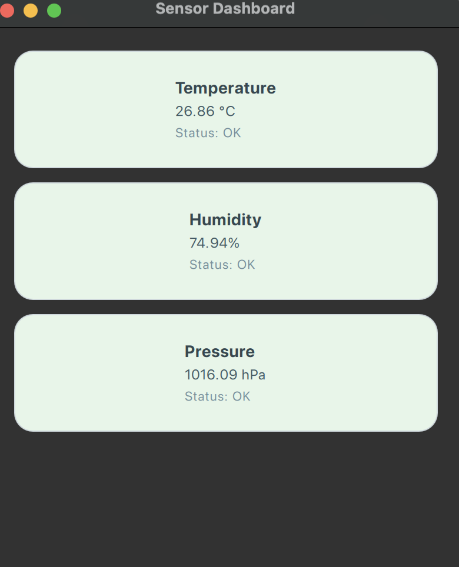

# SensorScope: Qt Embedded Dashboard for ESP32 🔧📡

A minimal yet powerful Qt/QML-based desktop dashboard to **visualize real-time sensor data** from an ESP32 over Serial.

## 🚀 Features

- 📡 Live sensor data display: Temperature, Humidity, Pressure
- 💾 Built using Qt 6 (QML + C++)
- 🔁 Serial communication with ESP32 via `QSerialPort`
- 📋 Dynamic UI updates using `ListModel` + `setProperty`
- ✅ Status color-coding for each sensor
- 🎯 Fully functional **embedded-style architecture** without external frameworks

## 🖼 Preview



## Video Demonstration

You can download the demonstration video here: 
[Download the video](./video/example.mov)

## 🔧 Tech Stack

- Qt 6 / QML
- C++17
- ESP32 (Arduino)
- QSerialPort
- CMake

## 🛠 Build & Run

```bash
mkdir build && cd build
cmake ..
make
./SensorScope

🧠 Notes
	•	ESP32 sends mock sensor data every second, formatted like:

Temperature: 25.3
Humidity: 50.1
Pressure: 1010.5


	•	QML parses incoming serial strings and updates each UI element live.

📂 Project Structure

src/
├── main.cpp
├── serialreader.h/.cpp
qml/
├── main.qml
resources/
├── qml.qrc

✨ Made by

Farya Farhang

⸻

This project is a personal embedded UI exercise combining my love for design with real-time system control. ❤️

---


